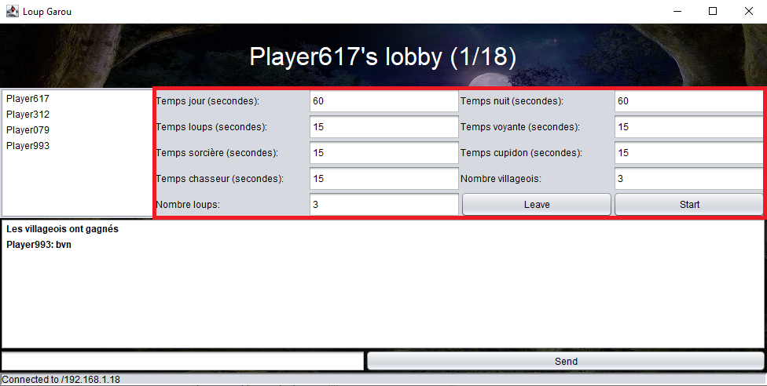

# Loup Garou

## Client

### Compilation: 

```bash
make build
```

### Éxecution:

```bash
make 1 # éxecuter une instance du client.
make 2 # éxecuter deux instances du client.
...
make 8 # éxecuter huit instances du client.

make kill # pour tuer toutes les instances du client.
```

## Serveur

### Éxecution:

```bash
python3 main.py
```

## Bugs

- Les options de jeu présentes dans les lobbies ne fonctionnent pas (pas implémenté).


- Certains clics ne s'enregistrent pas si on change de fenêtre entre les clients (pour voter par exemple il faut parfois faire plusieurs cliques).
